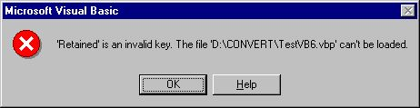



## Convert operations

### Description

This niftey little program converts visual basic 6 files to visual basic 5 files in seconds (well, how ever fast you are) :)

I hate when people using VB6 mark their projects as VB6 only, when 98% of them could, and will, work in VB5. But try it, use VB5 to open a VB6 file, and you get an error saying that "Retained is an invalid key".

Most people don't know how to stop this, and disregard any VB6 file as useable under VB5. Convert Operations puts a stop to this.
 
### More Info
 

             |
---                |---
**Submitted On**   |2001-01-27 21:21:14
**By**             |[N/A](https://github.com/Planet-Source-Code/PSCIndex/blob/master/ByAuthor/empty.md)
**Level**          |Intermediate
**User Rating**    |5.0 (10 globes from 2 users)
**Compatibility**  |VB 5\.0, VB 6\.0
**Category**       |[VB function enhancement](https://github.com/Planet-Source-Code/PSCIndex/blob/master/ByCategory/vb-function-enhancement__1-25.md)
**World**          |[Visual Basic](https://github.com/Planet-Source-Code/PSCIndex/blob/master/ByWorld/visual-basic.md)
**Archive File**   |[CODE\_UPLOAD142231272001\.zip](https://github.com/Planet-Source-Code/convert-operations__1-14762/archive/master.zip)

